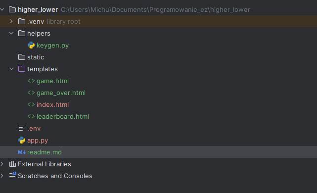

potrzeba dockera żeby uruchomić 

stawiasz sobie baze redisa :
docker run -p 6379:6379 -it redis/redis-stack:latest

instalujesz pozycje z requirements.txt

użyj sobie keygen i stwórz FLASK_SECRET_KEY
wklejasz FLASK_SECRET_KEY do .env 

pliki dockerowe które są w projekcie to work in progress jak coś

docker-compose build

docker-compose up